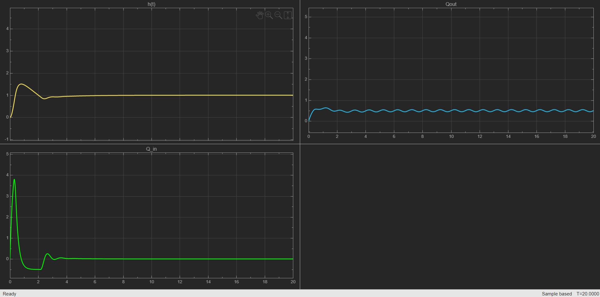

# nonlinear-tank-level-pid-control
# Nonlinear Tank Level Control Using PID

A MATLAB/Simulink project for controlling the liquid level of a nonlinear tank using a PID controller. The model demonstrates closed-loop level regulation, actuator limitations, disturbance rejection, and the effect of PID tuning on system response.

## Project Overview

Maintaining a constant liquid level is a common control problem in industrial processes such as chemical plants, water treatment systems, storage tanks, and manufacturing facilities.

In this project, the tank level is controlled by adjusting the inlet flow rate. The liquid leaves the tank through an outlet, while a PID controller continuously compares the desired tank level with the measured level and corrects the inlet flow accordingly.

The objective is to maintain the required liquid level even when disturbances are introduced into the system.

## Control System

The system follows a standard closed-loop feedback structure:

```text
Reference Level
      ↓
   Error
      ↓
PID Controller
      ↓
Actuator / Inlet Flow
      ↓
Tank Dynamics
      ↓
Measured Tank Level
      └──────── Feedback
```

The controller calculates the error as:

```text
e(t) = h_ref(t) - h(t)
```

where:

* `h_ref` = desired tank level
* `h` = actual tank level
* `e` = control error

The PID controller generates the control signal:

```text
u(t) = Kp·e(t) + Ki∫e(t)dt + Kd·de(t)/dt
```

where:

* `Kp` = proportional gain
* `Ki` = integral gain
* `Kd` = derivative gain

## Tank Model

The tank is modeled as a nonlinear dynamic system.

The change in liquid volume depends on the difference between inlet and outlet flow:

```text
A dh/dt = Qin - Qout
```

where:

* `A` = tank cross-sectional area
* `h` = liquid level
* `Qin` = inlet flow rate
* `Qout` = outlet flow rate

The outlet flow depends on the liquid level and is modeled using Torricelli's law:

```text
Qout = Cd · a · √(2gh)
```

where:

* `Cd` = discharge coefficient
* `a` = outlet area
* `g` = gravitational acceleration
* `h` = tank liquid level

Because the outlet flow depends on `√h`, the tank behaves as a nonlinear system.

## Simulink Model

The complete control system is implemented using MATLAB/Simulink.

The model contains:

* Reference level input
* PID controller
* Actuator saturation
* Anti-windup protection
* Nonlinear tank dynamics
* Flow disturbance
* Feedback loop
* Scope for response visualization

Add a screenshot of the model here:

```markdown

```

## Actuator Saturation

In a practical system, the pump or control valve cannot provide unlimited flow.

Therefore, actuator saturation is included in the simulation to restrict the controller output within realistic operating limits.

Without saturation limits, the controller may demand an inlet flow that cannot physically be produced.

## Anti-Windup

When actuator saturation occurs, the integral component of the PID controller may continue accumulating error.

This phenomenon is known as **integral windup**.

Anti-windup protection is used to prevent excessive integral accumulation and improve system recovery after saturation.

## Disturbance Rejection

A disturbance is introduced into the system to simulate variations in flow conditions.

The controller attempts to compensate for the disturbance and return the liquid level to its reference value.

This allows the model to demonstrate one of the main advantages of feedback control: maintaining the required output even when operating conditions change.

## Simulation Results

The response of the tank level can be observed using the Simulink Scope.

The simulation can be used to analyze:

* Rise time
* Settling time
* Overshoot
* Steady-state error
* Controller response
* Disturbance rejection
* Effect of PID gains

Example simulation output:



## PID Tuning

The behaviour of the system can be modified by changing the PID gains.

### Increasing Proportional Gain `Kp`

Generally results in:

* Faster system response
* Reduced error
* Possible increase in overshoot

### Increasing Integral Gain `Ki`

Generally results in:

* Reduction of steady-state error
* Improved tracking of the reference level
* Possible increase in oscillations or settling time

### Increasing Derivative Gain `Kd`

Generally results in:

* Improved damping
* Reduced overshoot
* Better transient response

The gains must therefore be selected carefully to obtain a balance between response speed, stability, and accuracy.

## Project Structure

```text
nonlinear-tank-level-pid-control/
│
├── README.md
├── LICENSE
│
├── model/
│   └── TankLevelControl.slx
│
└── results/
    ├── Simulink_Model.png
    └── Results_Scope.png
```

## Requirements

To run the project:

* MATLAB
* Simulink
* Control System Toolbox if required by your MATLAB configuration

## How to Run

1. Download or clone the repository.
2. Open MATLAB.
3. Navigate to the `model` directory.
4. Open:

```text
TankLevelControl.slx
```

5. Run the Simulink model.
6. Open the Scope blocks to observe the liquid-level response.
7. Modify PID gains or disturbance parameters to study their effect on system behaviour.

## Experiments

The model can be used for several control-system experiments:

* Change the desired liquid level.
* Modify the PID gains.
* Introduce different disturbances.
* Compare responses with and without anti-windup.
* Change tank dimensions.
* Modify outlet area.
* Change actuator saturation limits.
* Analyze controller performance under different operating conditions.

## Applications

Tank-level control systems are commonly found in:

* Chemical processing plants
* Water treatment facilities
* Beverage production
* Oil and gas processing
* Pharmaceutical manufacturing
* Industrial storage systems
* Process automation

## Tools Used

* MATLAB
* Simulink
* PID Control
* Nonlinear Dynamic Modeling
* Feedback Control

## Learning Outcomes

Through this project, the following control-system concepts can be studied:

* Closed-loop feedback control
* PID controller operation
* Nonlinear system modeling
* Integral windup
* Actuator saturation
* Disturbance rejection
* Transient response
* Steady-state behaviour

## Future Improvements

Possible extensions to the project include:

* Automatic PID tuning
* Comparison between PI and PID controllers
* Fuzzy logic level control
* Model Predictive Control
* Two-tank coupled system
* Pump dynamics
* Sensor noise simulation
* Real-time implementation using PLC or microcontroller hardware

## License

This project is distributed under the terms specified in the `LICENSE` file.

If the Simulink model was originally derived from or modified from another MIT-licensed project, the original copyright and license notice should remain included as required by the MIT License.
